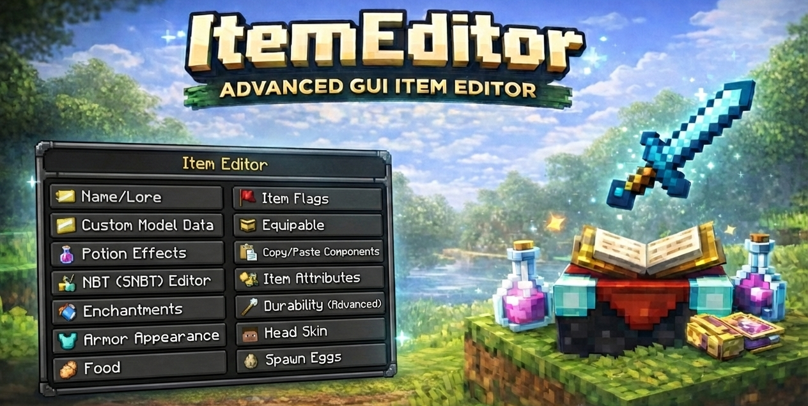
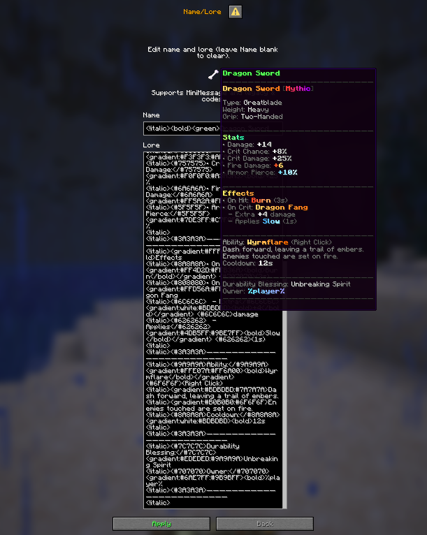
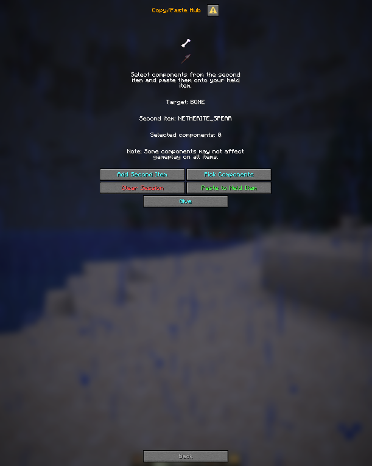
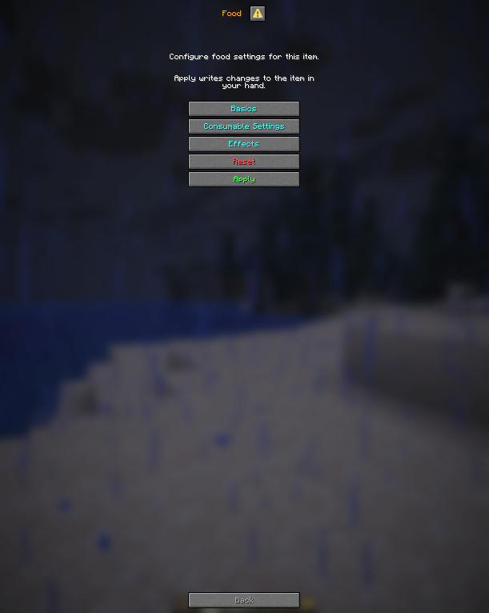
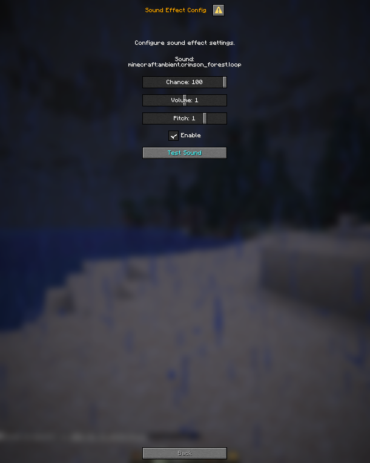

# 🧰 ItemEditor
**Advanced GUI Item Editor for Minecraft (1.21.7 – 1.21.11)**

<p align="center">
  
</p>

ItemEditor is a powerful in-game GUI tool that allows you to fully customize items without command spam or external editors.  
Hold an item, open the menu, and edit everything visually.

---

## ✨ Features

### 🧭 Category-based GUI
Clean and simple menus, designed to be fast and intuitive.

- **Name / Lore**
- **Item Flags**
- **Custom Model Data**
- **Equippable**
- **Potion Effects**
- **Copy / Paste Components**
- **NBT / SNBT Editor**
- **Item Attributes**
- **Enchantments** (Safe / Unsafe)
- **Durability (Advanced)**
- **Armor Appearance**
- **Head Skin**
- **Food**
- **Spawn Eggs**

---

## 🖼 User Interface Preview

<p align="center">
  
  
</p>
<p align="center">
  
  
</p>
<p align="center">
  
  
</p>

---

## 🔁 Copy / Paste Components
Copy specific components from a second item and paste them into your held item.

- Select exactly what to copy
- Safe session handling
- Perfect for RPG / custom gear workflows

---

## 🍖 Food Editor
Configure food behavior directly in-game:

- Basic food values
- Consumable settings
- On-consume effects
- Sound effects
- Random teleport / potion logic

---

## ✨ Enchantments Editor
- Safe / Unsafe mode
- Set levels from **0 – 255**
- Clear all / bulk apply
- Designed for advanced custom items

---

## 📌 Commands
```
/ie
```

---

## 🔐 Permissions

ItemEditor uses a **granular permission system**, allowing server owners to control exactly which features staff can access.

---

### 🔑 Base Access
```text
itemeditor.use
```
- Allows players to use the `/ie` command
- Required to open the ItemEditor GUI

---

### 📂 Menu Access (GUI Categories)

Each menu can be controlled individually, or all at once.

```text
itemeditor.menu.*
```
Grants access to **all ItemEditor menus**.

Individual menu permissions:
```text
itemeditor.menu.name_lore         # Name & Lore editor
itemeditor.menu.flags             # Item Flags
itemeditor.menu.meta              # Custom Model Data
itemeditor.menu.equippable        # Equippable settings
itemeditor.menu.potion            # Potion Effects
itemeditor.menu.copy_paste        # Copy / Paste Components
itemeditor.menu.nbt               # Show NBT menu entry (read-only)
itemeditor.menu.attributes        # Item Attributes
itemeditor.menu.enchants          # Enchantments
itemeditor.menu.durability        # Durability (Advanced)
itemeditor.menu.armor_appearance  # Armor Appearance
itemeditor.menu.head_skin         # Head Skin
itemeditor.menu.food              # Food Editor
itemeditor.menu.spawn_eggs        # Spawn Eggs
```

> 💡 **Note:**  
> `itemeditor.menu.nbt` only shows the NBT menu.  
> Writing/editing NBT requires an additional permission (see below).

---

### 🧾 NBT / SNBT Editor
```text
itemeditor.nbt
```

---

### ⭐ Full Access
```text
itemeditor.*
```
- Grants **all ItemEditor permissions**
- Includes:
  - `/ie` command
  - All menus
  - NBT / SNBT editor

---

### 🧩 Recommended Permission Setup

**Staff (Safe setup):**
```text
itemeditor.use
itemeditor.menu.*
```

**Admins (Full control):**
```text
itemeditor.*
```

---

## ✅ Compatibility
- **Minecraft:** 1.21.7 – 1.21.11  
- **Server:** Paper *(For Dialog)*  
- **Java:** 21+

---

## 🛠 Installation
1. Download the plugin jar  
2. Place it into `/plugins/`  
3. Restart the server  
4. Hold an item and run `/ie`

---

## 💬 Support & Feedback
If you encounter issues, please provide:
- Server type & version
- Plugin version
- Steps to reproduce
- Console logs (if any)

---

## 📜 License
All rights reserved.  
This project is intended for use on Minecraft servers only.

---

**ItemEditor** — because editing items should be powerful.
